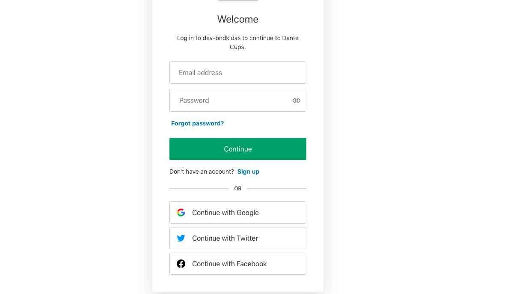
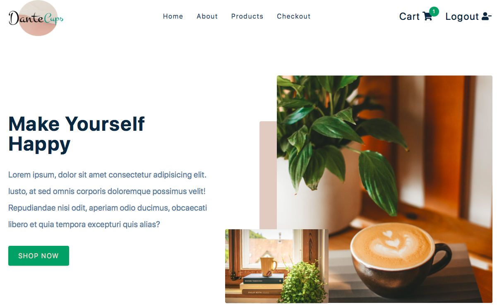
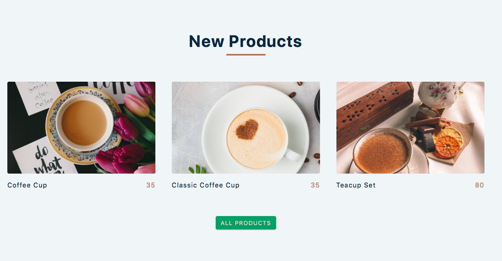
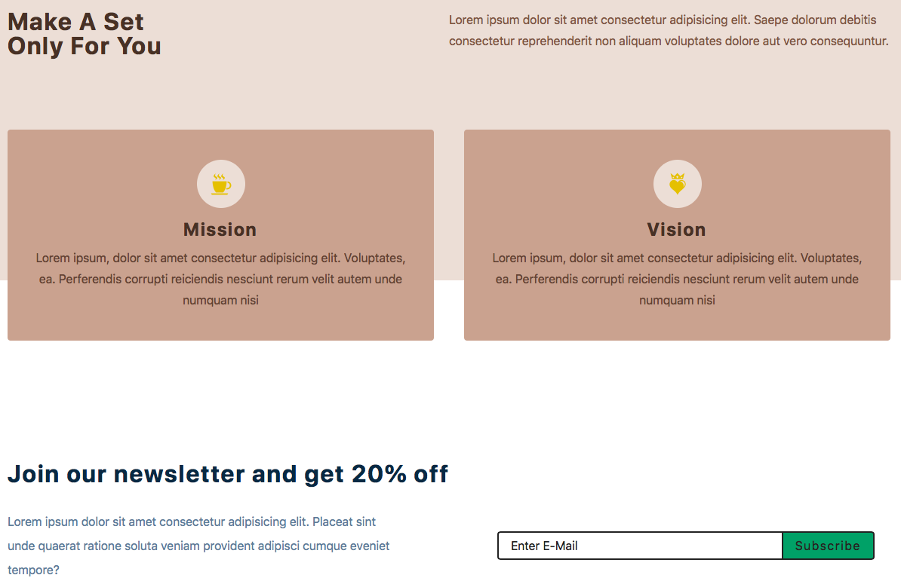
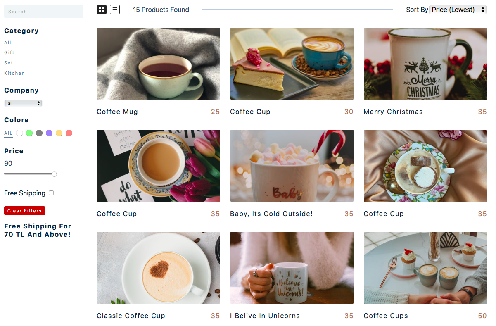
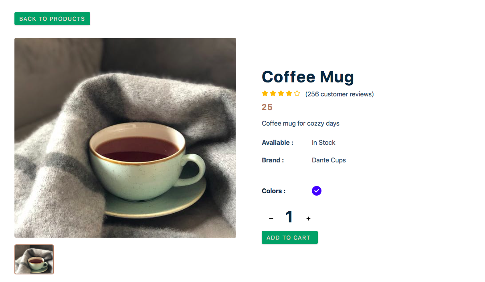

# E-commerce Website

## Dante Cups

Dante cups is an e-commerce site where products can be added or removed dynamically, where the user can easily access all product information, and where they can easily filter while searching for products. It is also a secure website where the user cannot shop without logging in. In addition, it is a website where all login and logout information of the user and the information of all users who subscribe to the e-bulletin are stored.

### Login page



### Home Page







### About Page


### Products Page



### Cart



## Check the Website

[Dante Cups](https://dantecups.netlify.app)

#### .env vars

- REACT_APP_AUTH_DOMAIN=
- REACT_APP_CLIENT_ID=
- REACT_APP_STRIPE_PUBLIC_KEY=
- REACT_APP_STRIPE_SECRET_KEY=

#### Extra Setup

```
npm install dotenv@8.2.0 stripe@8.130.0 @stripe/react-stripe-js@1.1.2 @stripe/stripe-js@1.11.0 netlify@6.0.12
```

```
npm install netlify-cli -D
```
